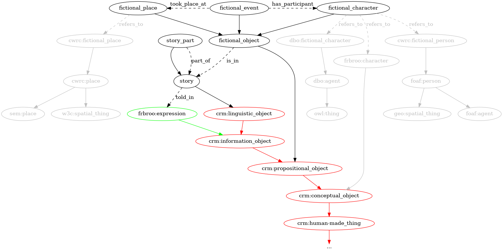

# ontologie de la fiction

pour construire une ontologie des émotions telles qu'elles apparaissent dans les textes littéraires, il nous faut élaborer, au moins en partie, une ontologie des textes littéraires: chose un peu trop complexe pour la visée de ce projet aux ambitions plus modestes, qui concentra son attention sur un type de textes littéraires seulement: la littérature de fiction narrative.

## personne et personnage

une seule question pose vraiment des difficultés pour construire une ontologie de ce type, à laquelle les ontologies existantes apportent des réponses variées que nous allons rapidement examiner: quel est le rapport que la classe _FictionnalEvent_ (_FictionalPerson_, _FictionalPlace_) entretient avec la classe _Event_ (_Person_, Place)?
car si les ontologies qui cherchent à décrire des fictions et les objets qui les peuplent ont comme but premier de décrire ces objets (personnages, lieux et événements fictifs), elles n'en doivent pas pour autant cesser de décrire les personnes, lieux et événements réels: traducteurices, auteurices, éditeurices des textes, lieu de publication ou de conservation des manuscrits, paysages réels ayant inspirés les descriptions fictives, etc. mais ces ontologies, pour la plupart du moins[^1], souhaitent distinguer les personnages de fictions et les personnes réelles.

[^1]: l'introduction de l'ontologie [SEM](https://sparql.cwrc.ca/ontologies/cwrc.html#FictionalPlace) (_Simple Event Model Ontology_) affirme explicitement qu'il s'agit de décrire n'importe quel événement, fictif ou non. c'est toutefois une ontologie moins pertinente pour nous puisqu'elle se concentre avant tout sur les événement (et nous sur les personnages, les entités les plus à même de montrer des émotions).

## personnage fictif et personnage fictionnel

on ne peut naturellement distinguer les personnages de fiction des personnes réelles qu'en adoptant une définition (et une théorie) de la fiction. comme une discussion des différentes théories de la fiction dépasse très largement le cadre de ce projet, je m'arrêterai à deux manières simples d'envisager la différence entre un _personnage de fiction_ et une personne réel: la première option consiste à dire que la différence entre les personnages de fictions et les personnes réelles résident dans le fait que les premier n'existent pas tandis que les seconds existent ou ont existé. [mickey mouse](https://dbpedia.org/page/Mickey_Mouse) serait un _personnage de fiction_ et [sei shonagon](https://fr.dbpedia.org/page/Sei_Sh%C5%8Dnagon) une personne réelle, quoi qu'ayant existé au XIème siècle. c'est l'option retenue par [__dbpedia__](https://dbpedia.org/ontology/FictionalCharacter), et même si cela peut sembler une manière assez naïve de définir la fiction, c'est un choix raisonnable pour la construction d'un savoir encyclopédique a-contextuel: dans le cadre d'une encyclopédie, il faut que mickey mouse soit fictif _partout_.
la deuxième option, à l'inverse, conçoit la fiction moins comme un mode d'existence (négative) de certains objets (les objets fictifs) que comme un contexte discursif[^2]: est un personnage de fiction n'importe quelle chose que l'on trouve dans une fiction et qui agit comme une personne. c'est ce qui permet de dire que dans certains romans, par exemple, telle paysage est en un sens un personnage: il semble jouer un rôle similaire au rôle que joue les personnes. de la même façon, la référence à des personnages réels dans des contextes fictionnels produit souvent (sinon toujours) des personnages fictionnels[^4].

[^2]: contexte discursif dans lequel certaines règles de communication sont suspendues (selon searle, très criticable etc....).

[^4]: un exemple parmi des milliers: emmanuelle pireyre reprenant la figure d'épicure dans _comment faire disparaître la terre_, dépeint comme un scénariste hollywoodien élaborant sa philosophie à partir de fiche bristols: "épicure déboucha donc le feutre vert et écrivit son z sur la feuille bristol du bout à droite: 'jardin où nous passons agréablement notre temps.' après quoi il se mit à déduire la cosmologie, la biologie, la religion et tous les paramètres utiles pour en arriver là [...]." (paris, seuil, coll. "fiction & cie", 2006, p.9-12).

en fait, on peut aussi, dans le cadre d'une analyse des textes narratifs (et, en fait, de n'importe quel type de représentation) ne pas s'embarrasser du tout de la notion de _fiction_ en définissant les personnages comme des représentation de personnes (dans un récit), sans chercher à fixer la référence de ces personnes et à en évaluer le degré de fictionnalité. mais les problèmes examinés ici sont à peu près les mêmes (_RepresentationOfPerson_ remplace _FictionalPerson_) et c'est pourquoi je me permets de n'y revenir que plus tard.

le choix de l'une ou de l'autre option influence le rapport qu'entretiendront, dans l'ontologie, les classes _FictionalCharacter_ et _Person_. si (option 1) on définit un _personnage de fiction_ comme une _personne fictive_, il apparait alors assez naturel de définir la classe _FictionalCharacter_ comme une sous-classe de la classe personne. c'est ce que fait par exemple l'ontologie [__cwrc__](https://sparql.cwrc.ca/ontologies/cwrc.html), portant sur les productions écrites canadiennes. l'avantage à faire cela, c'est que toutes les propriétés définies pour une [_Person_](http://xmlns.com/foaf/0.1/Person) le sont _de facto_ aussi pour une [_FictionalPerson_](https://sparql.cwrc.ca/ontologies/cwrc.html#FictionalPerson). cela nous évite alors de devoir reproduire, pour les choses de fictions, des classes et des propriétés identiques, comme en miroir de l'ontologie pour les choses non-fictives.
l'inconvénient, c'est que si notre définition d'une _Person_ est assez restrictive (si, par exemple, l'on considère que seules les humain·es sont des personnes), alors certaines _FictionalCharacter_ pourraient ne pas remplir les conditions pour être des personnes et l'ontologie pourrait devenir incohérente. on pourrait par exemple définir que les classes _Plant_ et _Person_ sont mutuellement exclusives: comment alors intégrer correctement un personnage-plante (qui par exemple parlerait)? pour éviter ces difficultés, __dbpedia__ fait un choix un peu différent et place la classe _FictionalCharacter_ non pas dans la classe _Person_ mais au même niveau: _FictionalCharacter_ et [_Person_](https://dbpedia.org/ontology/person) sont toutes deux des sous-classe de la classe [_Agent_](https://dbpedia.org/ontology/Agent).

dans __dbpedia__ comme dans l'ontologie __cwrc__, une chose frappante est l'absence d'ancêtres communs entre les différents types d'objets fictionnels: le __cwrc__, par exemple, définit une classe [_FictionalPerson_](https://sparql.cwrc.ca/ontologies/cwrc.html#FictionalPerson) et une classe [_FictionalPlace_](https://sparql.cwrc.ca/ontologies/cwrc.html#FictionalPlace). le nom de ces classes invite à les imaginer proches, mais leurs positions dans l'ontologies sont absolument éloignées: _FictionalPlace_ est connectée à _Place_ et _FictionalPerson_ à _Person_, mais rien ne relie _FictionalPlace_ à _FictionalPerson_, car rien ne relie _Person_ à _Place_, comme si la fictionnalité ne constituait qu'une propriété contingente, négative et secondaire de certaines choses, comme si les lieux fictifs étaient des lieux comme tous les autres, à l'exception qu'ils n'existent pas. la raison à cela est que le __cwrc__, s'occupant (je crois) moins du contenu des textes que des conditions sociales et politiques de leurs productions, ne cherche pas (je présume) à mettre les objets fictionnels en relations avec d'autres objets fictionnels, mais seulement à les mettre en relations avec les objets non fictionnels: telle personnage est inspiré par telle personne, tel lieu imaginaire par telle paysage.

à l'inverse des ontologies qui font des _FictionalPeople_ des sortes de personnes on trouve pas exemple [__frbroo__](https://repository.ifla.org/handle/123456789/659). la visée de __frbroo__ est avant tout bibliographique ou muséographique: __frbroo__ cherche à décrire des objets culturels, leur date d'acquisition par une institution, le lieu où ils sont stockés, les personnes qui les ont fabriquées, etc. c'est avant tout la dimension _matérielle_ des objets qui guide la structure de l'ontologie (y compris lorsqu'il s'agit de distinguer les différents niveaux de matérialité d'une oeuvre d'art[^6]). les personnages fictifs n'ont donc aucune raison de se trouver près des personnes réelles, car jamais ils ne feront circuler d'oeuvres. dans __frbroo__, qui est basé sur le [__cidoc-crm__](https://www.cidoc-crm.org/), _Character_ est donc une sous-classe de [_ConceptualObject_](https://cidoc-crm.org/Entity/E28-Conceptual-Object/version-7.1.1). la raison de la séparation entre _Character_ et _Person_ tient dans le fait que les actions d'un _personnage_ représentant une _personne réelle_ pourraient être incohérente avec les actions de cette personne. "Rather than merging characters with real persons, they should be described as disjoint, but related entities[^7]." je ne parviens pas à déterminer, en revanche, si, dans le vocabulaire du __frbroo__, un _Character_ est spécifique à une oeuvre ou si, dans une logique "transfictionnelle[^9]", tous les harry potter sont le même harry potter:

[^6]: frbr (et frbroo à sa suite) distingue notamment _Work_ (l'oeuvre dans toutes ses matérialités et versions possibles, passées, présentes ou futures), _Expression_ (une version d'une oeuvre, dans une forme matérielle spécifique mais pouvant exister en plusieurs exemplaire) et _Manifestation_ (un seul exemplaire d'une seule version).

> Examples: 
> - Harry Potter [in J.K. Rowling’s series of novels and the films based on them]
> - Sinuhe the Egyptian [in Mika Waltari’s novel]
> - The Knights of the Round Table [in fiction][^8]

[^7]: https://cidoc-crm.org/f38-character
[^8]: _ibid._
[^9]: richard saint-gelais, _Fictions transfuges. La transfictionnalité et ses enjeux_, Paris, Seuil, coll. "poétique", 2011.

## les personnages comme objets conceptuels

quoi qu'il en soit, l'ontologie de haut-niveau que constitue le __cidoc-crm__ propose une classe plus appropriée pour les personnages de fictions: la classe [_PropositionalObject_](https://www.cidoc-crm.org/Entity/e89-propositional-object/version-6.2.2), une sous-classe de _ConceptualObject_. on peut comprendre dans son nom pourquoi __frbroo__ n'a pas choisi cette classe comme super-classe de _Character_: les _personnages_ que l'on trouve (par exemple) dans des peintures n'ont pas une nature _propositionnelle_. or, les exemples données dans la description de la classe est sans équivoque, on y trouve notamment: "_The image content of the photo of the Allied Leaders at Yalta 1945_ (E38)". les exemple que le __cidoc-crm__ énumère ensuite démontrent sa pertinence pour des oeuvres de fictions:

> - _The character "Little Red Riding Hood" variants of which appear amongst others in Grimm brothers’ ‘Rotkäppchen’, other oral fairy tales and the film 'Hoodwinked'_
> - _The place "Havnor" as invented by Ursula K. Le Guin for her ‘Earthsea’ book series, the related maps and appearing in derivative works based on these novels_[^3]

[^3]: https://www.cidoc-crm.org/Entity/e89-propositional-object/version-6.2.2

dans notre ontologie, _FictionalCharacter_ sera donc une sous-classe de _PropositionalObject_.

dans ces exemples, on comprend que les personnages existent en partie indépendamment des oeuvres dans lesquelles leurs actions sont racontées: les oeuvres, en quelques sortes, instancient (ou reprennent) des personnages et les représentent, mais elles ne les contiennent pas. c'est en fait pour cette raison, à mon avis, que _Character_ est dans le __frbroo__ une sous-classe de _ConceptualObject_, au même niveau que _Work_: il s'agit de viser le concept de tel ou tel personnage, dans tous ses exemplaires possibles. les personnages sont ainsi extérieurs aux oeuvres (aux représentations). or, il me semble qu'il est utile d'avoir une classe désignant les personnages comme des choses _dans_ des oeuvres. car dans les modèles de __frbroo__, __cwrc__ ou __dbpedia__, cette classe n'existe pas, il n'y a pas d'objet désignant ce qui, dans un récit, représente une personne fictive ou réelle (ou un lieu, un événement, ...). les _Character_ de __frbroo__, les _FictionalPerson_ de __cwrc__ sont donc en un sens des _prototypes_, quoi qu'ils n'existent que par le fait que ces prototypes soient représentés dans des oeuvres. la façon dont nous utiliserons _FictionalCharacter_ dans notre ontologie sera donc sensiblement différente: nos _FictionalCharacters_ ne seront pas _représentés_ dans des récits, ils seront _dans_ ces récits. mais ces _Character_ peuvent ensuite tout à fait _faire référence_ à des _Person_ ou des _Character_: pour définir cette référence, nous utilisons la propriété [_refers_to_](https://cidoc-crm.org/node/4480), issue du __cidoc-crm__, laquelle prend comme _domain_, justement, un _PropositionalObject_, nous n'avons donc aucun besoin de la reformuler, et cette propriété nous permettra de connecter notre ontologie à chacune de ces ontologies. (nous ne peuplerons, dans le cadre de ce projet, ni les classes référées ni les propriétés _refers_to_ qui servent uniquement à inscrire notre ontologie dans le réseaux des ontologies qui prennent en charge des oeuvres fictionnelles, c'est pourquoi ces classes et propriétés sont en gris dans le diagramme en haut de cette page.)

il n'y a, dans les fiction, pas que des _personnages_. il y a aussi, par exemple, des _lieu_ et des _événement_. ces deux types de choses sont intéressantes dans le cadre d'une analyse des émotions dans les textes littéraires: car les émotions, souvent, engendrent des événements ou en résultent, et ces événement prennent place en des lieux. une fois notre ontologie peuplée, nous pourrions ainsi nous demander si, par exemple, la tristesse est une émotion qui s'exprime plutôt dans des lieux fermés, intérieurs, et la peur plutôt dans des lieux ouverts.

nos _FictionalCharacter_, _FictionalEvent_ et _FictionalPlace_ sont des classes assez similaires: toutes trois, dans notre perspective, ont une nature commune qui est repose sur le fait d'être _dans_ des discours fictionnels, et toutes trois peuvent _faire référénce_ à des choses réelles: même nature et propriétés sont des raisons suffisante pour la création d'une classe les regroupant toutes: la classe _FictionalObject_, sous-classe de _PropositionalObject_, qui contient des choses qui se trouvent dans (et constituent) des fictions (telle ou telle chose, dans telle ou telle fiction). ce qui constituent un _FictionalObject_, c'est d'abord qu'il est l'élément d'une fiction. ensuite seulement sa nature précisée: personnage, pantin, paysage ou fantôme.

en nous inspirons des propriétés que le __cidoc-crm__ définit pour les événements, nous définissons deux propriétés liant ces classes: un événement peut avoir lieu quelquepart _take_place (FictionalPlace)_), et un événement peut inclure des participant·es passif·vis ou actif·ves (_has_participant (FictionalCharacter_).

# récit, fiction, diégèse

la dernière chose qu'il nous faut définir, c'est ce que jusqu'ici j'ai appelé de façon un peu ambigüe "fiction" ou "récit". la discussion des multiples sens du mot _récit_ a été faite en france de façon canonique par gérard genette à la suite des formalistes russes traduits par tzvetan todorov[^11]: le terme récit désigne à la fois la diégèse (succession d'événements), narration (le réagencement de ces événements par la personne qui les relate), énonciation (l'événement constitué par le fait qu'une personne en train de raconter).
nous ne nous préoccuperons pas du récit comme _énonciation_, et l'articulation des deux autres termes complexifierait notre ontologie de façon inutile car nous ne sommes pas en mesure d'analyser automatiquement les relations entre diégèse et narration. nous ne distinguerons donc pas ces différents sens de _récit_ dans notre ontologie et prendrons plutôt un terme qui peut désigner les deux premiers sens (événements et narration): _Story_, à laquelle la classe _FictionalObject_ est reliée par la propriété _is_in_.

cette _Story_ n'existe évidemment pas toute seule, et l'usage de __frbroo__ pour la définition de son contentant semble tout indiqué, puisque l'ontologie est précisément développée pour cela et qu'elle constitue un standard. elle propose trois classes que nous pourrions potentiellement utiliser: [_Work_](https://ontome.net/class/217/namespace/6) qui désigne l'idée d'une oeuvre d'art dans n'importe laquelle de ses exemplification (la 9ème symphonie de beethoven ou _one and three chairs_ de joseph kosuth), [_Expression_](https://ontome.net/class/218/namespace/6) qui désigne une version spécifique de l'oeuvre (la traduction du "corbeau" de poe par baudelaire), dans tous ses exemplaires possibles (elle est "faite de signes"), et [_Manifestation_](https://ontome.net/class/1276/namespace/218) qui désigne le prototype d'une seule matérialisation d'une version (la version poche, réimprimée en 2022, de la _chronique des indiens guayaki_ de clastres). comme notre corpus est fait de textes récupérés en lignes sur le [projet gutemberg](https://www.gutenberg.org/), c'est la classe _Expression_ qui semble la plus adéquate, car les caractéristiques physiques de l'exemplaire ayant servi à la numérisation nous sont à la fois inaccessibles et inutiles: seuls les signes linguistiques nous intéressent. cette nature linguistique de la _story_ nous amène à en faire une sous-classe de la classe [_LinguisticObject_](https://cidoc-crm.org/html/cidoc_crm_v7.1.3.html#E33) du cidoc-crm.

puisque nous n'identifions pas les émotions au niveau des oeuvres entières mais les repérons plutôt dans des _passages_ (paragraphe, phrase, court chapitre), nous ajoutons une classe _StoryPart_, qui est à la fois une partie d'une _Story_ et une _Story_ elle-même, c'est-à-dire à la fois sous-classe de, et en relation avec _Story_ (via la propriété _part_of_). ainsi, les propriétés reliant les _FictionalObject_ aux _Stories_ sont aussi valables pour les _StoryPart_. d'un point de vue conceptuel, cela revient à dire que des extraits de narrations ont (souvent) eux-même une nature narrative (de façon similaire, dans le modèle __frbroo__, _ExpressionFragment_ est à la fois une sous-classe et une partie de _Expression_).

[^11]: gérard genette, _figure iii_, paris, seuil, coll. "poétique", 1972, pp. 71-2; tzvetan todorov (éd.), _théorie de la littérature. textes des formalistes russes_, paris, point, coll. "essais", 1965 (2001).
